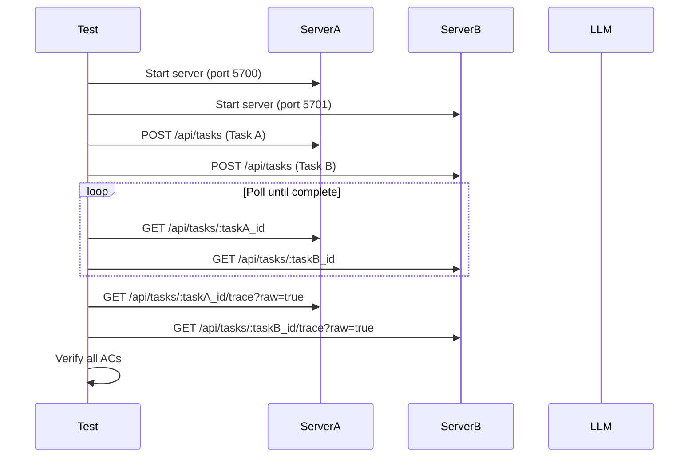

# Relay Live E2E Two-Web Test Specification

## Overview

This specification defines an automated E2E test that verifies two independent Web UI instances can run tasks through the full Relay → LLM → Claude Code pipeline without interference.

## Purpose

Prove that:
1. Two Web UI servers can operate independently on different ports
2. Tasks submitted through Web UI reach completion via real LLM execution
3. No cross-contamination occurs between instances

## Acceptance Criteria

### AC-1: Dual Server Startup
- Server A runs on port 5700 with dedicated stateDir/projectRoot
- Server B runs on port 5701 with dedicated stateDir/projectRoot
- Both servers respond to health check (`GET /api/health`)

### AC-2: Task Completion
- Task A submitted to Server A reaches `COMPLETE` or `COMPLETED` status
- Task B submitted to Server B reaches `COMPLETE` or `COMPLETED` status
- No manual user intervention required

### AC-3: No Error Events
- No ERROR events in task traces
- No server-side errors (HTTP 5xx responses)
- No unhandled exceptions

### AC-4: LLM Interaction Evidence ("offer相当")
- Task A has >= 2 `LLM_RESPONSE` events in trace
- Task B has >= 2 `LLM_RESPONSE` events in trace
- This proves real LLM interaction occurred, not stub/mock

### AC-5: File Isolation
- Files generated by Task A exist only in Server A's projectRoot
- Files generated by Task B exist only in Server B's projectRoot
- No file leakage between projectRoots

### AC-6: Namespace Isolation
- Server A's namespace does not appear in Server B's stateDir
- Server B's namespace does not appear in Server A's stateDir
- Task IDs are unique per server

## Technical Design

### Test Environment Setup

```
/tmp/pm-e2e-two-web-{timestamp}/
├── server-a/
│   ├── state/          # stateDir for Server A
│   └── project/        # projectRoot for Server A
└── server-b/
    ├── state/          # stateDir for Server B
    └── project/        # projectRoot for Server B
```

### Server Configuration

| Property    | Server A        | Server B        |
|-------------|-----------------|-----------------|
| Port        | 5700            | 5701            |
| Namespace   | e2e-server-a    | e2e-server-b    |
| stateDir    | {base}/server-a/state | {base}/server-b/state |
| projectRoot | {base}/server-a/project | {base}/server-b/project |

### Task Prompts

**Task A Prompt:**
```
Create a file named `hello-from-a.txt` containing the text "Hello from Server A".
Then read the file and confirm its contents.
```

**Task B Prompt:**
```
Create a file named `hello-from-b.txt` containing the text "Hello from Server B".
Then read the file and confirm its contents.
```

### Verification API Endpoints

1. **Task Status**: `GET /api/tasks/:task_id`
   - Response includes `status` field
   - Completion: `status === 'COMPLETE' || status === 'COMPLETED'`

2. **Task Trace**: `GET /api/tasks/:task_id/trace?raw=true`
   - Response includes `entries` array
   - Count `LLM_RESPONSE` events for AC-4 verification

### Polling Strategy

- Poll interval: 5 seconds
- Maximum wait: 5 minutes per task
- Timeout triggers test failure

## Implementation Details

### Test File Location

`tests/e2e/relay-two-web-live.spec.ts`

### Test Flow



### Verification Steps

1. **AC-1**: Health check on both servers after startup
2. **AC-2**: Poll task status until COMPLETE/COMPLETED or timeout
3. **AC-3**: Check trace for ERROR events, check HTTP responses
4. **AC-4**: Count LLM_RESPONSE events in trace >= 2
5. **AC-5**: Check file existence in correct projectRoot only
6. **AC-6**: Verify stateDir contents don't cross-reference

## Evidence Artifacts

Test run generates evidence in:
- `.tmp/relay-live-e2e-two-web/` directory
- Contains: server logs, task traces, verification results

## Prerequisites

- API key configured (Anthropic or OpenAI)
- No stubs/mocks - real LLM execution required
- Sufficient API quota for 4+ LLM calls

## Non-Goals

- UI visual testing (this is API-level verification)
- Performance benchmarking
- Load testing with many concurrent tasks

## References

- ConversationTracer: `src/trace/conversation-tracer.ts`
- Task API: `src/web/server.ts`
- Task Status: `src/models/enums.ts`
