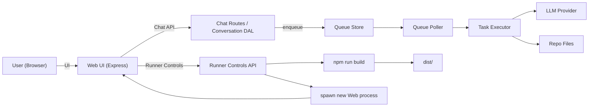
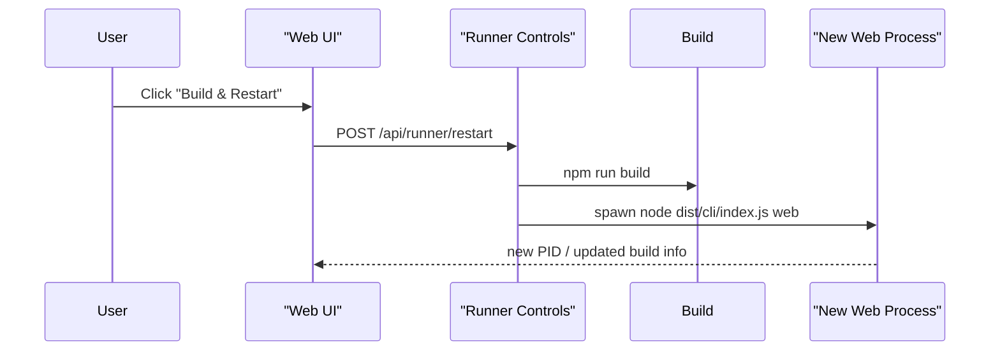

# Architecture

## Core Components

CLI Interface connects to Runner Core  
Runner Core connects to Configuration Manager  
Runner Core connects to Session Manager  
Runner Core connects to Lifecycle Controller  

Lifecycle Controller connects to L1 Subagent Pool (maximum 9 parallel)  
Lifecycle Controller connects to L2 Executor Pool (maximum 4 parallel)  

L1 Subagent Pool connects to Claude API (read-only)  
L2 Executor Pool connects to Claude Code CLI (write-enabled)  

Runner Core connects to Evidence Manager  
Runner Core connects to Lock Manager  

Evidence Manager stores data under .claude/evidence  
Lock Manager stores lock files under .claude/locks  

Configuration Manager reads .claude/settings.json  
Configuration Manager reads .claude/agents  
Configuration Manager reads .claude/rules  

## System Diagram (Web + Runner + Self-Update)

## Execution Flow

User invokes start command  
Runner creates a session  
Session initializes evidence storage  

Runner executes the seven-phase lifecycle  

For each phase:  
Runner invokes L1 Subagents for analysis  
L1 Subagents return analysis results  

During Execution phase only:  
Runner invokes L2 Executors (maximum 4 parallel)  
Executors perform implementation  
Executors emit evidence  

After each phase:  
Runner validates phase completion  

After final phase:  
Runner generates final report  
Runner returns status to user
